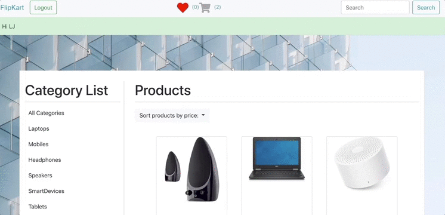

## Codaisseur-FlipKart - an online webshop

## Table of contents

- [Preface](#Preface)
- [How to start](#How-to-start)
- [Technologies used for this project](#Technologies-used-for-this-project)
- [Contributors](#Contributors)

## Preface

This project is purely a frontend application, that demonstrates a webshop experience for electronic products. The users can search products by category or by name, add to shopping cart or wishlist. The application displays the total value for the items in the shopping cart. For logged in users a promotion code is provided, which when applied to the total value offers a 10% discount on the total price.

Here's a little demo...

## How to start

1. Clone the git repository into a new directory on your computer: `git clone git@github.com:LavanyaJay/Flipkart.git`
2. Run `npm install` on your terminal to install all the dependendencies
3. Run `npm start` to get a preview of the front-end

## Technologies used for this project

1. React with `create-react-app`
2. `redux` and `react-redux` to set up a redux store and dispatch actions
3. `react-router` and `react-router-dom` to use routes in react and have dom elements that work with them
4. `superagent` to fetch data from the database
5. `redux-thunk` to dispatch actions for the redux store

## Contributors

- Lavanya Jayapalan | [Github](https://github.com/LavanyaJay)
- Simona Winnekes | [Github](https://github.com/winnekes)
